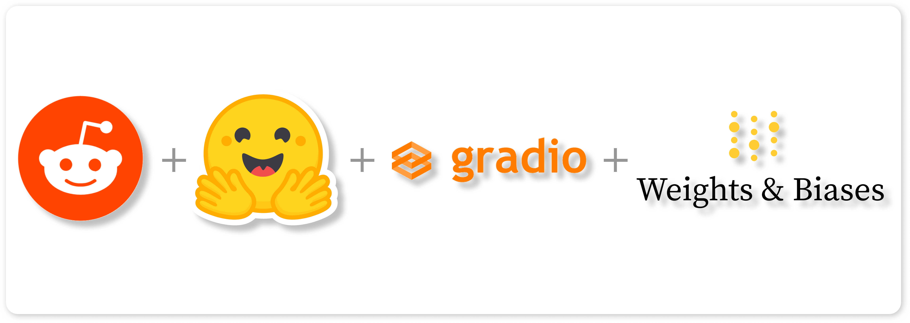
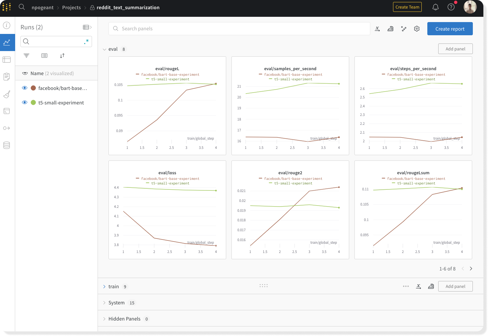
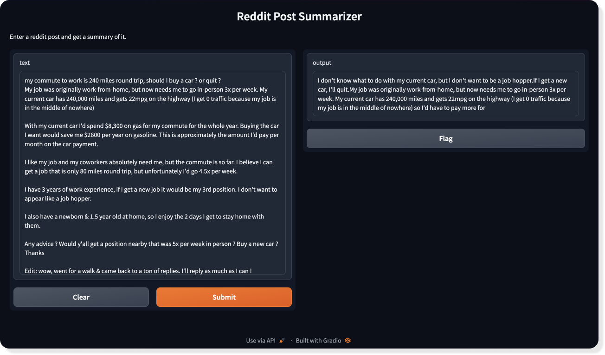

# Reddit Post Summarizer    

  

This project aims to fine-tune severals pre-trained language models to generate summaries of Reddit posts. The models are fine-tuned on the Reddit dataset from [Hugging Face](https://huggingface.co/datasets/reddit). All the experiments are performed with **Hugging Face's library** (Transformers), **PyTorch** can be followed and analyzed with **Weights & Biases**.

 The project is structured as follows:

 - The folder **training** contains the script for fine-tuning the models : `fine_tuning.py`.
 - The folder **interface** contains the script of the app interface : `app.py`.

## Data Description

The Reddit dataset from huging face contains 3.8 million Reddit posts from 2006 to 2016. It has been collected and normalized in a five steps pipeline. The dataset is composed of 8 columns, the most important ones are : 

- **content** : the text of the post
- **summary** : the summary of the post (from TL;DR)

## Model Training and Fine-Tuning

The idea was to fine-tune several pre-trained language models on the Reddit dataset. Transformers library provides a lot of pre-trained models and great tools for fine-tuning. The models are fine-tuned with the `Trainer` class from the library. The `Trainer` class is a high-level class that handles the training loop, the evaluation loop, the prediction loop and the optimization. It also provides a lot of useful features like logging, gradient accumulation, mixed precision training, etc.

To be able to compare results, all the metrics are logged with Weights & Biases wich is a great tool for tracking and visualizing machine learning experiments. The `Trainer` class provides a great integration with Weights & Biases. The metrics are logged in real time during the training and the evaluation. The results can be visualized in the Weights & Biases dashboard such like this :

  

Once the models fine-tuned, they are saved on the Weights & Biases platform. The models can be downloaded from the dashboard or with the Weights & Biases API. It is also possible to put a model in a production environment by using their model registry. The model registry allows to deploy a model in a production environment with a single command.

## Application Interface 

The interface is built with **Gradio**. Gradio is a python library that allows to build and deploy web interfaces for machine learning models. It is very easy to use and provides a lot of useful features. The interface is composed of a text input and a button. The user can enter a Reddit post and click on the button to get a summary of the post :

  

